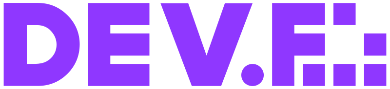

  

# **GENERACION 3WEB - PROTALENTO / DEV.F**

En este respositorio encontraras todas las practicas que se han realizado en el curso de desarrolo web impartido por DEV.F

---

# INTRO HTML Y JS ☕

- # **<a href="./intro_html">HMTL y CSS</a>**
- # **<a href="./clon_google">Clon de Google </a>**
- # **<a href="./">CLON Pinterest </a>**
- # **<a href="./intro_javascript">INTRO A JS </a>**

 

---

# JAVASCRIPT BASICO Y AVANZADO ☕☕

 

- # **<a href="./DOM">Clase de DOM</a>**
  - [x] manejo del DOM
  - [x] import y export

 

- # **<a href="./QR_VANILLA">Generador de QR </a>**
  - [x] manejo del DOM

 

- # **<a href="./ATM">CAJERO ATM </a>**
  - [x] manejo del DOM
  - [x] metodos de array
  - [x] localStorage y sessionStorage

 

- # **<a href="./PIEDRA_PAPEL_TIJERAS">JUEGO PIEDRA PAPEL O TIJERAS </a>**
  - [x] manejo del DOM
  - [x] metodos de array
  - [x] Objetos

 

- # **<a href="./dragonball-clase">DRAGON BALL API  </a>**
  - [x] NODE, NPM Y VITE
  - [x] Async await / Promises
  - [x] Fetch
  - [x] JSON
  - [x] Consumo de api

 

- # **<a href="./DEVF_PLANETAS">PLANETAS API  </a>**
  - [x] NODE, NPM Y VITE
  - [x] Async await / Promises
  - [x] Fetch
  - [x] JSON
  - [x] Consumo de api

 

- # **<a href="./pokedex">POKEDEX API  </a>**

  - [x] NODE, NPM Y VITE
  - [x] Async await / Promises
  - [x] AXIOS
  - [x] JSON
  - [x] Consumo de api

 

---

# INTRO A FRONTEND ☕☕☕

 

- # **<a href="./react-101">REACT NO ES UN FRAMEWORK </a>**

  - [x] Instalando React sin Nodejs

 

- # **<a href="./pomodoro-app">RELOJ / POMODORO  </a>**

  - [x] INSTALACION
  - [x] Instalar LINTER
  - [ ] material-tailwind
  - [x] useState, useEffect,
  - [x] Componentes
  - [x] PROPS: parents and childrens

 

- # **<a href="./TODO-APP">TODO APP  </a>**

  - [x] Context y métodos para manejo de estado
  - [x] Material UI

 

- # **<a href="./spa-react">Single Page App  </a>**

  - [x] **Teoria de SPA**
  - [x] **Tailwind css**

 

- # **<a href="./react-routes">React Rotuer  </a>**

  - [x] react-router-dom
  - [] Rutas Privadas y Rutas Públicas

 

- # **<a href="https://github.com/cchavezmx/redux-class">Redux  </a>**

  - [x] Introducción a REDUX

 

---

# Frontend Avanzado 🦾🦾🦾

- # **<a href="./prueba-tec">PRUEBA TÉCNICA NEXTJS  </a>**

  - [x] Next.js
  - [x] custom hooks
  - [x] Material UI
  - [x] zustand

 

- # **<a href="./darkmod-test">Dark Mode  </a>**

  - [x] Next.js
  - [x] custom hooks
  - [x] zustand

 

---

# Temas

- ## [Arquitectura de modulos CSS](https://github.com/cchavezmx/Arquitectura-de-modulos-CSS)
- ## [Guía - Aprendiendo SQL](https://github.com/cchavezmx/Aprendiendo-SQL)

- ## [Teoria del Testing](./teoria-test)

---

## **EXTRA BONUS**

Sitio con retos, que se resueven en cada clase 🙈🙈🚀

## **[RETOS JS](https://github.com/cchavezmx/JAVASCRIPT---EJERCICIOS)**
