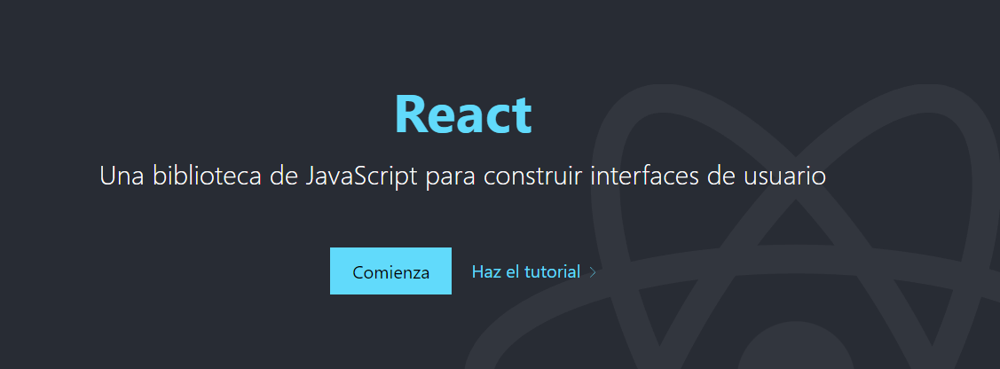
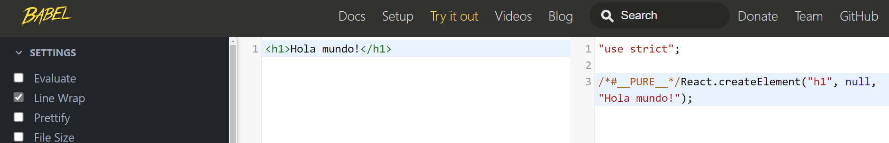

## React no es un freemwork



# PRIMEROS PASOS

Antes de enseñarles a usar React, instalando con Vite o create-react-app
hay que demostrar que React es una libreria que nos ayuda a crear interfaces de usuario:

En el index encontraras la forma de usar React sin Node u otras cosas y da paso a la explicación de la integración de JSX y el por que.

---

# JSX Y React.createElement

También en el Código encontraras la forma de implementarlo a ir explicando paso a paso el proceso

1 - Primer paso: Creamos una constante con React.createElement

2 - Creamos un componente llamado TitlePrincipal

3 - Renderizamos usando el componente antes creado

```javascript
<script type="text/babel">
       const app = document.querySelector("#root")
     // React code will go here

       const reactElement = React.createElement

       {/* creamos un componente de React */}
       const TitlePrincipal = ({ title, icon = "🤯" }) => {
            // su propia logica y su propio estado
       return reactElement("h1", { className: 'title' }, title)
       }

   {/* renderizamos en el elemento */}
   ReactDOM.render(reactElement(Title, { title: "Buenas noches" }), app)
</script>
```

---

Pronto lo vamos complicando mas:

```javascript
<script type="text/babel">
const app = document.querySelector("#root")
const reactElement = React.createElement

//   React se basa en componentes

    const TitlePrincipal = ({ title, icon = "🤯" }) => {
            // su propia logica y su propio estado
        return reactElement("h1", { className: 'title' }, title)
    }

    ReactDOM.render(reactElement(
    "div",
    null,
   [
        reactElement(Title, { title: "Buenas noches", icon: '🚀' }),
        reactElement(Title, { title: "Saludos" }),
         reactElement(Title, { title: "Esto esta muy enrredado, no creen? 😂" })
     ]),
     app
    )

</script>
```

---

Terminamos explicando cómo es usando JSX

```javascript
<script type="text/babel">
   const app = document.querySelector("#root")
   // React code will go here
   const reactElement = React.createElement

   //   React se basa en componentes
   // cuando creamos componentes debe estar escritos en notación PasacalCase
   const TitlePrincipal = ({ title, icon = "🤯" }) => {
       return (<h1 onClick={() => alert("Hola")} className="title">{title}{icon}</h1>)
   }

   ReactDOM.render(
       <div>
           <TitlePrincipal title="Es más facil con JSX" icon="🚀" />
           <TitlePrincipal title="Soy una segunda etiqueta" />
       </div>,
       app
   )
</script>
```

Esta simplificación de Código es gracias a que al pasar un fragmento de código jsx por babel:



Este nos ayuda a poder escribir una especie de HTML (jsx) que se interpreta en el navegador con la notación que necesita la librería de React.

---

# Referencias:

- [React - Tania Rascia]("https://www.taniarascia.com/getting-started-with-react/")

- [Midudev]("https://www.youtube.com/watch?v=T_j60n1zgu0")
