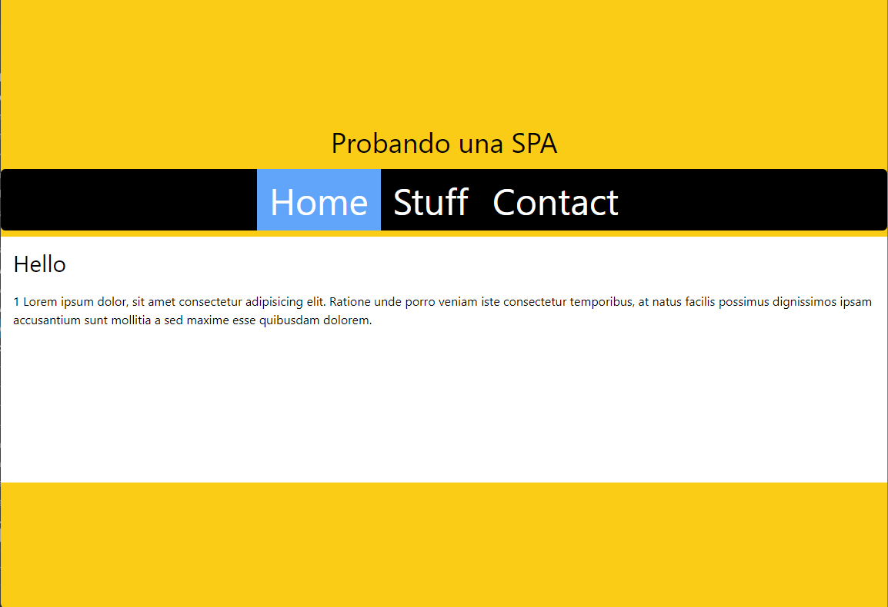

## Probando una SPA

Una SPA (Single Page Application) es un tipo de aplicación web que carga una sola página en el navegador y luego utiliza JavaScript para cambiar dinámicamente el contenido de esa página en respuesta a las acciones del usuario. Esto significa que, a diferencia de una aplicación web tradicional, en una SPA no se recarga la página completa cada vez que el usuario realiza una acción, sino que solo se actualizan las partes necesarias de la página.

Esto permite una experiencia de usuario más rápida y fluida, ya que se evita tener que volver a cargar toda la página y se reduce la cantidad de datos que se transfieren entre el navegador y el servidor.

Las SPA son comunmente desarrolladas con JavaScript, utilizando librerías o frameworks como React, Angular, Vue.js.

---

# [Evolución en el FrontEnd](https://www.epicweb.dev/the-webs-next-transition)

---

### Vista previa

